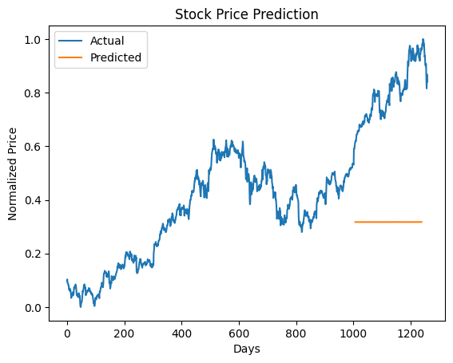

# Model Card

## Model Description

**Input:** A sequence of 20 previous normalized closing prices of a stock

**Output:** A single predicted normalized closing price for the next day

**Model Architecture:** A recurrent neural network (RNN) with a long short-term memory (LSTM) layer and a linear layer

## Performance

The model achieves a training loss of 0.0002 and a test loss of 0.0012 on the AAPL data, using mean squared error (MSE) as the metric. The model performance is measured on the historical stock prices of Apple (AAPL) from the S&P 500 index, covering a period of five years from 2013 to 2018. The following plot shows the actual and predicted stock prices on the test set:

## Limitations

The model has some limitations that may affect its reliability and validity, such as:

- The model only uses one feature (closing price) as the input, which may not capture the full complexity and dynamics of the stock market.
- The model only uses data from one company (AAPL) and one index (S&P 500), which may not represent the diversity and variability of the stock market.
- The model only uses data from a specific time period (2013-2018), which may not reflect the current or future state of the stock market.
- The model assumes that the stock price is stationary and follows a linear or nonlinear pattern, which may not hold true in reality.
- The model does not account for external factors that may affect the stock price, such as news, events, sentiments, trends, etc.

## Trade-offs

The model has some trade-offs that should be considered before using it, such as:

- The model may introduce or amplify biases or errors in the data or the prediction, which may lead to unfair or inaccurate outcomes or decisions for some individuals or groups.
- The model may be misused or abused for malicious or fraudulent purposes, such as manipulating or exploiting the stock market or its participants.
- The model may be overtrusted or overrelied on by its users, who may neglect their own judgment or responsibility when using the model.